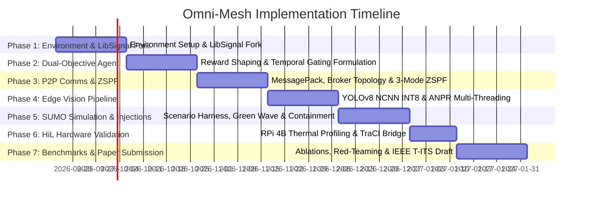

# OMNI-MESH: Master Architecture, Simulation & Implementation Roadmap
**A Decentralized, Two-Tiered Multi-Agent System for Unified Traffic Optimization and Edge-Based Threat Containment**

---

## 1. Executive Summary & Vision

Omni-Mesh bridges the longstanding chasm between **adaptive civilian traffic optimization** and **proactive municipal security/emergency routing**. Built as a **Neuro-Symbolic, Two-Tiered Multi-Agent System (MAS)**, Omni-Mesh enables:
1. **Sub-second edge intelligence** on commodity IoT hardware (Raspberry Pi 4B at ~£70/node) running multi-threaded decoupled vision, optical character recognition (ANPR), and reinforcement learning (RL).
2. **Transponder-free, vision-driven multi-hop Green Waves** negotiated autonomously peer-to-peer (P2P) across neighboring intersection agents.
3. **Automated ANPR-driven physical containment** bridging the critical 2–15 minute gap between suspect detection and law enforcement intervention.
4. **Active Zero Single Point of Failure (ZSPF)**: Graceful reconstitution from full-orchestrated mesh (Mode 0) to autonomous P2P MARL (Mode 1) to localized Max-Pressure islands (Mode 2), guaranteeing a provable throughput performance floor.

---

## 2. System Architecture & Component Design

```
+-----------------------------------------------------------------------------------+
|                        TIER 2: GLOBAL ZONE ORCHESTRATOR                           |
|  - Symbolic Rule Engine & Macro-Anomalies Supervisor                              |
|  - Global ANPR Watchlist Management & Cross-Zone Vehicle Trajectory Tracking       |
|  - Emergency & Containment Authorization (Human-in-the-Loop Verification)         |
+------------------------------------------+----------------------------------------+
                                           | Heartbeat (1 Hz) / Macro Policy Directives
                                           v
+-----------------------------------------------------------------------------------+
|               TIER 1: THE DECENTRALIZED EDGE MESH (Intersection Nodes)             |
|                                                                                   |
|  [Hardware: Raspberry Pi 4B + Passive Heatsink/5V PWM Fan / Optional Coral TPU]   |
|                                                                                   |
|  +-----------------------------------------------------------------------------+  |
|  | Thread A: High-Freq Perception (15 FPS)                                      |  |
|  | - YOLOv8n-NCNN INT8 (320x320) -> Bounding Boxes, Classes & Tracking IDs    |  |
|  | - Lane Queue Density Estimator -> Generates Local State Vector s_i(t)        |  |
|  +-----------------------------------------------------------------------------+  |
|  +-----------------------------------------------------------------------------+  |
|  | Thread B: Event-Triggered ANPR (1-3 FPS)                                    |  |
|  | - Vehicle ROI Crop -> PaddleOCR -> Target Plate Candidate Identification     |  |
|  | - Multi-Node Temporal Consensus Filter (>= 2 nodes within 30s window)       |  |
|  +-----------------------------------------------------------------------------+  |
|  +-----------------------------------------------------------------------------+  |
|  | Thread C: Low-Freq RL Control Policy (1-2 Hz, <2% CPU)                      |  |
|  | - Input: [s_i(t), Neighbor Messages m_N, Mode Flag m_threat]                |  |
|  | - Model: Lightweight MLP Policy (DQN / PPO) -> Phase Switching Action a_i   |  |
|  | - Reward: Temporally Gated Objective (Civilian Throughput vs Security/EV)    |  |
|  +-----------------------------------------------------------------------------+  |
|  +-----------------------------------------------------------------------------+  |
|  | Thread D: Asynchronous MQTT / ZeroMQ I/O Loop                                |  |
|  | - MessagePack Binary Serialization (~80 bytes/msg)                           |  |
|  | - Event-Driven State Broadcasting (Delta-triggered: ||s_i - s_last|| > delta) |  |
|  | - 3-Mode ZSPF State Machine & Liveness Monitor                               |  |
|  +-----------------------------------------------------------------------------+  |
+-----------------------------------------------------------------------------------+
```

### 2.1 The Decoupled Multi-Threaded Edge Pipeline
To prevent the RPi 4B Cortex-A72 CPU from hitting the 80°C thermal throttle threshold (which cuts clock frequency from 1.5 GHz to 600 MHz and degrades YOLOv8 to <5 FPS, causing tracking ID collapse):
- **Perception (Thread A)** runs independently at 15 FPS using **NCNN INT8 quantized models**.
- **ANPR (Thread B)** is event-triggered only when vehicle bounding box confidence and plate visibility exceed dynamic thresholds ($\theta_{\text{plate}} > 0.85$).
- **RL Action Selection (Thread C)** runs at traffic cycle frequency (1–2 Hz), consuming <2% CPU.
- **Communication (Thread D)** runs asynchronously with non-blocking sockets.

### 2.2 ZSPF 3-Mode State Machine
| Mode | Trigger / Condition | Control Logic | Fail-Safe Guarantee |
| :--- | :--- | :--- | :--- |
| **Mode 0: Full Mesh** | Normal operation. Tier-2 Orchestrator beacon active ($f=1\text{ Hz}$). | Multi-Agent RL + Global Macro Overrides. | Optimal global flow & instant coordinated containment. |
| **Mode 1: Autonomous P2P** | Tier-2 heartbeat timeout ($>3\text{s}$). | Pure MARL with neighbor state exchange via local MQTT/ZeroMQ brokers. | Full cooperative traffic flow & P2P Green Waves without central server. |
| **Mode 2: Island Mode** | Local broker timeout / communication loss ($>5\text{s}$). | Fixed-rule Max-Pressure algorithm using local camera queue estimates. | Provable throughput degradation bound: $\frac{T_{\text{MP}} - T_{\text{RL}}}{T_{\text{RL}}} \le 15\text{--}25\%$. Zero gridlock collapse. |

---

## 3. Simulation Architecture & Pipeline Mechanics

The simulation setup bridges macroscopic traffic realism with low-level inter-agent communication and hardware-in-the-loop validation:

```
+-----------------------------------------------------------------------------------+
|                             CO-SIMULATION HARNESS                                 |
+-----------------------------------------------------------------------------------+
| [Offline Training Phase]                                                          |
| - CityFlow Simulator: High-throughput MARL pre-training across 100+ intersections |
|   (10-100x faster than SUMO for policy exploration and hyperparameter search).    |
+-----------------------------------------------------------------------------------+
| [High-Fidelity Evaluation & Scenario Injection Phase]                             |
| - SUMO (Simulation of Urban MObility): Microscopic vehicle physics, lane          |
|   dynamics, acceleration models (Krauss/IDM), and multi-modal traffic.           |
| - TraCI (Traffic Control Interface): Real-time Python bridge for injecting signal |
|   phases, emergency vehicles, and querying intersection states.                   |
| - Mock Edge Camera / Synthetic Vision Stream: SUMO raster view / synthetic frame   |
|   generator pushing simulated camera feeds into the vision inference pipeline.    |
+-----------------------------------------------------------------------------------+
| [Inter-Agent Messaging & Middleware Layer]                                        |
| - Eclipse Mosquitto / NanoMQ Broker: Clustered edge broker topology.              |
| - Network Impairment Injector: NetEm / Toxiproxy to simulate packet loss, jitter,  |
|   bandwidth constraints, and broker crash events.                                |
+-----------------------------------------------------------------------------------+
| [Hardware-in-the-Loop (HiL) Bridge]                                              |
| - Physical Raspberry Pi 4B cluster (or single node running with virtual mesh peers)|
|   receiving synthetic video / TraCI telemetry via USB/Ethernet and feeding back   |
|   signal decisions to SUMO.                                                       |
+-----------------------------------------------------------------------------------+
```

---

## 4. Required Datasets & Traffic Demand Modeling

### 4.1 Road Networks & Traffic Demand Matrices
To establish peer-reviewed credibility, Omni-Mesh must evaluate on established public benchmark datasets via the **LibSignal** repository framework:

| Dataset | Intersections | Topology | Source / Purpose |
| :--- | :--- | :--- | :--- |
| **Jinan Dataset** | 12 (3x4 grid) | Real-world arterial grid | Real-world surveillance camera sensor flows (LibSignal standard). |
| **Hangzhou Dataset** | 16 (4x4 grid) | Complex urban arterials | High-density multi-lane intersections with asymmetric peak flows. |
| **New York City (Manhattan)** | 48 intersections | High-density grid | Stress-tests mesh scaling, broker message load, and multi-hop routing. |
| **Synthetic Stress Grid** | 20 (4x5 grid) | Dual arterial corridors with cross streets | Designed specifically to evaluate emergency vehicle Green Waves and containment maneuvers. |

### 4.2 Emergency & Anomaly Profiles
- **Emergency Vehicle (EV) Insertion**: Synthetic injection of ambulances/fire engines at variable background traffic saturations (0.4, 0.7, 1.0, 1.2 v/c capacity ratio).
- **Route Trajectories**: Pre-planned origin-to-destination corridors spanning 4 to 8 hops across the grid.

### 4.3 Vision & ANPR Watchlist Datasets
- **Vehicle Detection & Classification**:
  - **COCO 2017 (Traffic subset)**: Cars, buses, trucks, motorcycles.
  - **Custom Emergency Vehicles Dataset**: Annotated dataset of ambulances and emergency service vehicles across various lighting conditions.
- **Automated License Plate Recognition (ANPR)**:
  - **CCPD (Chinese City Parking Dataset)** or **AOLP (Application-Oriented License Plate)**: >100k annotated license plate crops with varied tilts, lighting, and weather conditions.
  - **Synthetic Plate Blur/Degradation Generator**: Motion blur, poor illumination, rain simulation to benchmark the multi-node consensus filter.

---

## 5. Testing, Verification & Red-Teaming Protocols

### Protocol 1: Civilian Throughput & Delay Baselines
- **Baselines to Beat**: Fixed-Time, Max-Pressure, CoLight (GAT-MARL), PressLight, and HiLight.
- **Metrics**:
  - Average vehicle travel time (s)
  - Average intersection delay (s/veh)
  - Queue length ($q$) and throughput (vehicles/hour)
- **Target**: Achieve $\ge 35\%$ reduction in average delay over Fixed-Time and equal or exceed CoLight's throughput while operating under edge compute constraints.

### Protocol 2: Transponder-Free P2P Green Wave Evaluation
- **Scenario**: An ambulance appears in the camera field of view at Node $(i, j)$ heading toward Node $(i, j+4)$.
- **Metrics**:
  - Emergency Vehicle Traversal Time across 5-hop corridor (target: $<45\text{s}$).
  - Downstream clearance delay (pre-clearing standing queues before arrival).
  - Cross-traffic penalty (delay incurred by orthogonal civilian traffic).

### Protocol 3: ANPR Threat Containment & Multi-Node Consensus
- **Scenario**: A flagged vehicle on the Tier-2 watchlist traverses the arterial corridor.
- **Evaluation Criteria**:
  - **Multi-Node Consensus Verification**: Flagged vehicle must be recognized with confidence $p > 0.95$ across $\ge 2$ consecutive intersections within 30 seconds.
  - **False Positive Rejection**: Demonstrates that single-camera misreads do not trigger spurious signal lockdowns.
  - **Containment Success Rate**: Percentage of runs where target vehicle is trapped at designated containment zone without causing uncontrolled multi-arterial gridlock.
  - **Throughput Recovery Time ($T_{\text{rec}}$)**: Measures how rapidly normal traffic flow resumes post-containment (Target: $T_{\text{RL}} < 120\text{s}$ vs $T_{\text{MaxPressure}} > 240\text{s}$).

### Protocol 4: Active ZSPF Fault Tolerance & Resilience Stress Testing
- **Test 4A (Tier-2 Failure)**: Kill the Tier-2 Orchestrator process mid-run. Measure packet loss, time to Mode 1 transition (heartbeat cutoff $\le 3\text{s}$), and continuity of P2P green wave negotiation.
- **Test 4B (Network / Broker Partition)**: Disconnect the MQTT broker. Measure time to Mode 2 transition ($\le 5\text{s}$) and verify throughput maintains the theoretical Max-Pressure bound ($\le 25\%$ degradation).

### Protocol 5: Hardware-in-the-Loop (HiL) Thermal & Resource Profiling
- **Testbed**: Physical Raspberry Pi 4B (4GB, Broadcom BCM2711) connected via Ethernet to the SUMO co-simulation harness.
- **Conditions**: 8-hour continuous stress test under four configurations:
  1. *RPi 4B Bare Board (No Cooling)* -> Record throttling temperature (87°C) and FPS drops (~3 FPS).
  2. *RPi 4B + Passive Heatsink* -> Measure sustained temperatures (~74°C).
  3. *RPi 4B + Active 5V PWM Fan* -> Measure sustained temperatures (<62°C, zero throttle).
  4. *RPi 4B + Fan + NCNN INT8 Quantization* -> Benchmark sustained 15–18 FPS with <55°C CPU temperature.

---

## 6. Implementation Roadmap: 20-Week Phase Plan



### Phase 1: Environment Setup & LibSignal Fork (Weeks 1–3)
- [ ] Initialize git repository and directory hierarchy.
- [ ] Fork [LibSignal](https://github.com/DaRL-LibSignal/LibSignal) as the baseline evaluation framework.
- [ ] Set up Python virtual environment with PyTorch, SUMO 1.18+, TraCI, and CityFlow.
- [ ] Reproduce CoLight and PressLight baseline metrics on the Jinan 12-intersection dataset to establish baseline benchmarks.

### Phase 2: Dual-Objective Agent & Reward Architecture (Weeks 4–6)
- [ ] Formulate the temporally gated composite reward function:
  $$r_i(t) = (1 - m(t)) \cdot r_i^{\text{traffic}} + m(t) \cdot r_i^{\text{security}}$$
- [ ] Augment state space with the binary threat flag $m \in \{0, 1\}$.
- [ ] Train edge RL agents in CityFlow on synthetic 20-intersection grid with random override events.
- [ ] Verify that RL policy avoids reward collapse and learns pre-adaptive phase rebalancing.

### Phase 3: P2P Communication & 3-Mode ZSPF State Machine (Weeks 7–9)
- [ ] Implement asynchronous messaging module supporting both MQTT (Mosquitto) and ZeroMQ.
- [ ] Integrate MessagePack serialization (reducing payload size from ~350B to ~80B).
- [ ] Implement event-triggered broadcasting ($\|s_i(t) - s_i(t_{\text{prev}})\| > \delta$).
- [ ] Code the atomic 3-mode state machine (Mode 0 $\to$ Mode 1 $\to$ Mode 2) with heartbeat failure detectors.

### Phase 4: Vision & ANPR Multi-Threaded Edge Pipeline (Weeks 10–12)
- [ ] Train / fine-tune YOLOv8n on vehicle and emergency classes.
- [ ] Export YOLOv8n to NCNN INT8 format (`model.export(format='ncnn')`).
- [ ] Build the multi-threaded pipeline:
  - Thread A (Perception, 15 FPS)
  - Thread B (PaddleOCR / Fast-ANPR, event-triggered)
  - Thread C (RL action selector, 1–2 Hz)
  - Thread D (Async Network I/O)
- [ ] Implement multi-node temporal consensus logic ($\ge 2$ nodes, $p > 0.95$ within 30s).

### Phase 5: End-to-End Simulation & Scenario Injections (Weeks 13–15)
- [ ] Construct the SUMO co-simulation test harness with TraCI.
- [ ] Implement synthetic emergency vehicle injection and verify P2P rolling Green Wave propagation.
- [ ] Implement Tier-2 watchlist containment scenario: orchestrator commands signal manipulation to barrier target vehicles.
- [ ] Run fault-injection experiments (kill orchestrator; partition network).

### Phase 6: Hardware-in-the-Loop (HiL) Validation on Raspberry Pi 4B (Weeks 16–17)
- [ ] Deploy the decoupled edge pipeline to physical Raspberry Pi 4B (4GB).
- [ ] Run 8-hour thermal characterization tests under idle, passive, and fan-cooled configurations.
- [ ] Measure CPU clock throttling, sustained FPS, and latency curves.
- [ ] Connect RPi 4B in the loop with the SUMO simulation server via Ethernet.

### Phase 7: Ablations, Red-Teaming, & Paper Drafting (Weeks 18–20)
- [ ] Execute comprehensive ablation studies:
  - Omni-Mesh vs. CoLight, PressLight, Fixed-Time.
  - Recovery time: Omni-Mesh RL vs. Max-Pressure post-containment.
  - False positive rejection rate with/without multi-node consensus.
- [ ] Assemble performance curves, thermal profiling tables, and Pareto frontier plots.
- [ ] Draft final manuscript formatted for *IEEE Transactions on Intelligent Transportation Systems (T-ITS)*.

---

## 7. Open Architectural Decisions & Immediate Next Steps

1. **Edge Acceleration Tier**:
   - *Baseline*: RPi 4B CPU-only with NCNN INT8 + active 5V fan (guaranteed zero additional hardware cost beyond ~£80 total).
   - *Optional Upgrade*: Add Google Coral USB TPU (£50) to demonstrate a secondary performance tier achieving ~30 FPS on edge.
2. **Simulation Vision Input**:
   - In simulation mode, decide whether to stream rendered SUMO GUI frames through YOLOv8, or mock camera detections with parameterized Gaussian detection noise ($\mu=0.98, \sigma=0.03$) to accelerate large-scale training.
3. **Repository Initialization**:
   - Ready to set up the clean project directory structure and begin Phase 1 with the LibSignal fork.
